<div align="center">

# Inkinesis

### Turning Illustrations into Portable 2D Character Rigs

**Describe a character. Bring your own illustration. Make it move.**


[](LICENSE)
[](docs/instructions/live2d_export.md)
<!-- When published: link the Project Website badge and replace the Paper badge with the arXiv link. -->

[See it move](#see-it-move) · [By the numbers](#by-the-numbers) · [Meet the characters](#meet-the-characters) · [Try the viewer](#try-the-viewer) · [VTube Studio](#live-in-vtube-studio) · [How it works](#how-it-works) · [Installation](#installation) · [Documentation](#documentation)

</div>

<!-- GitHub renders a bare attachment URL as an inline video player. The same file is kept in docs/media/showcase.mp4. -->
https://github.com/user-attachments/assets/1be8c51f-5301-4c25-a2aa-9c6d5d08ef7f

*All 27 characters in a scrolling showcase: neutral rigs above, animated rigs below. Actual Inkinesis playback with supported head, expression, arm, leg and garment motion.*

## See it move

<table>
<tr>
<td width="67%">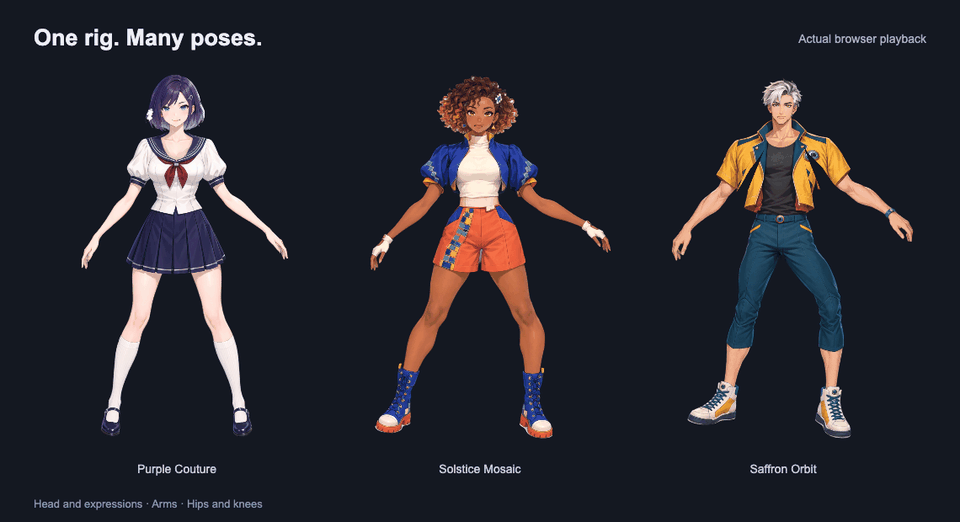</td>
<td width="33%">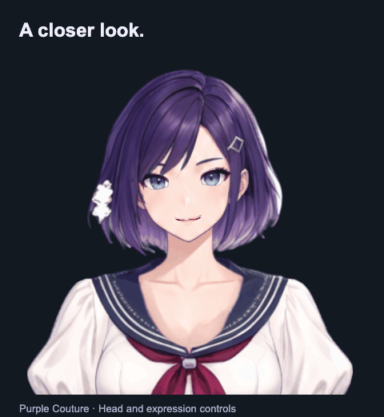</td>
</tr>
</table>

*Actual playback of existing rigs: head and expression controls, articulated arms, and hip and knee movement. Available movements vary by character.*

Inkinesis turns a text prompt or a character illustration into a layered, animated 2D rig. Explore the result in your browser, save the complete asset, and export it for **Inochi2D** or **Live2D**.

| Create | Animate | Take it with you |
| --- | --- | --- |
| Start with a description or upload an illustration. | Preview head movement, expressions, and supported limb motion. | Save the complete run and export `.inp` or a Live2D package. |

## By the numbers

| | |
| --- | --- |
| **230–237 seconds** | saved illustration to first export across four recorded runs; remote H100 80GB decomposition, with local preparation and export |
| **27 characters** | ready to download, each as an Inochi2D `.inp` and a Live2D package |
| **27 / 27** | exported Live2D models evaluated in the official Cubism Core with zero Core-aware drawable mismatches |
| **780 poses per rig** | every limb key and half-grid sample checked for reversed triangles; the articulated rigs reverse none |

Timings include decomposition inference and transfers, but exclude image generation, later revisions and repeated validation. Runtime checks measure technical compatibility, not visual quality; see [validation details](docs/instructions/live2d_export.md#near-key-runtime-differences). A technical report describing the method and these measurements is in preparation.

## Meet the characters

These examples were built from AI-generated illustrations using Inkinesis and saved as reusable rigs so you can try the viewer without a GPU or API key. You can also describe your own character or upload an illustration; supported movements depend on the design and the results of layer and motion checks.

<table>
<tr><td align="center">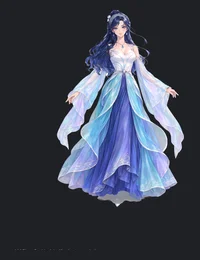</td><td align="center">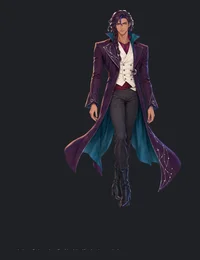</td><td align="center">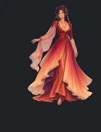</td><td align="center">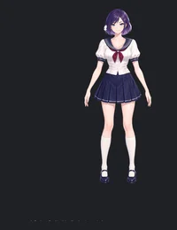</td><td align="center">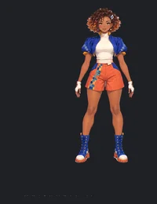</td><td align="center">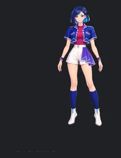</td><td align="center">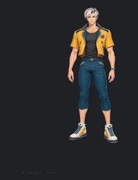</td><td align="center">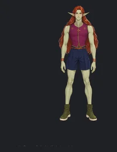</td><td align="center">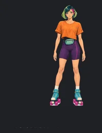</td></tr>
<tr><td align="center"><sub>Tidal Glass</sub></td><td align="center"><sub>Nocturne Cartographer</sub></td><td align="center"><sub>Ember Waltz</sub></td><td align="center"><sub>Purple Couture</sub></td><td align="center"><sub>Solstice Mosaic</sub></td><td align="center"><sub>Ultramarine Tempo</sub></td><td align="center"><sub>Saffron Orbit</sub></td><td align="center"><sub>Lichen Starweaver</sub></td><td align="center"><sub>Neon Skater</sub></td></tr>
<tr><td align="center">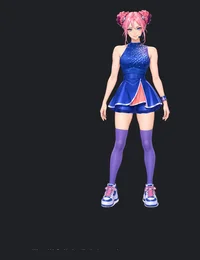</td><td align="center">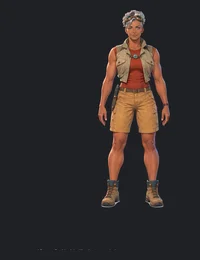</td><td align="center">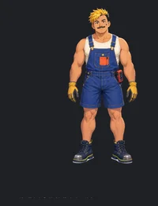</td><td align="center">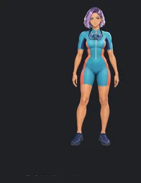</td><td align="center">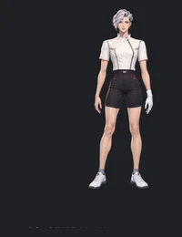</td><td align="center">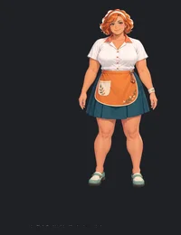</td><td align="center">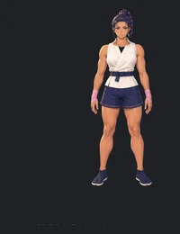</td><td align="center">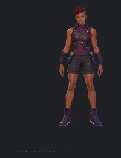</td><td align="center">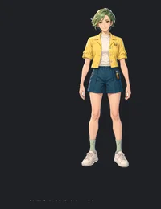</td></tr>
<tr><td align="center"><sub>Bubblegum Idol</sub></td><td align="center"><sub>Desert Ranger</sub></td><td align="center"><sub>Voltage Mechanic</sub></td><td align="center"><sub>Coral Diver</sub></td><td align="center"><sub>Silver Fencer</sub></td><td align="center"><sub>Tangerine Chef</sub></td><td align="center"><sub>Sakura Kendo</sub></td><td align="center"><sub>Obsidian Rogue</sub></td><td align="center"><sub>Lemon Scientist</sub></td></tr>
<tr><td align="center">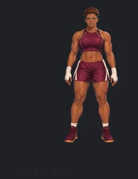</td><td align="center">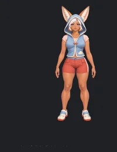</td><td align="center">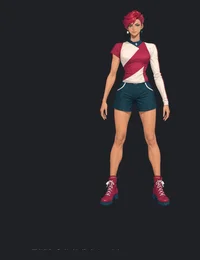</td><td align="center">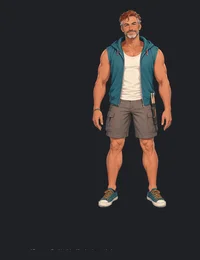</td><td align="center">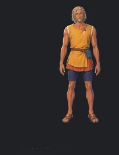</td><td align="center">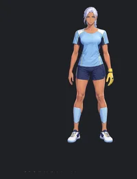</td><td align="center">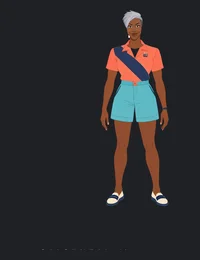</td><td align="center">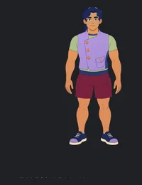</td><td align="center">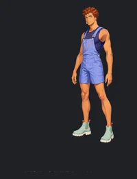</td></tr>
<tr><td align="center"><sub>Maroon Boxer</sub></td><td align="center"><sub>Fennec Aeronaut</sub></td><td align="center"><sub>Splitlight Atelier</sub></td><td align="center"><sub>Teal Drummer</sub></td><td align="center"><sub>Ochre Nomad</sub></td><td align="center"><sub>Frost Goalie</sub></td><td align="center"><sub>Papaya Broadcaster</sub></td><td align="center"><sub>Inkblue Locksmith</sub></td><td align="center"><sub>Periwinkle Glassblower</sub></td></tr>
</table>

*Neutral-pose previews rendered from the 27 example rigs. Open any of them with **Pick an Avatar** in the viewer; the first Download installs both formats locally. To make your own, see [Installation](#installation).*

## Try the viewer

With **Node.js 22+**, you can open the interface before configuring generation:

```sh
npm ci
npm run dev
```

The browser opens at **http://localhost:5200/**. Use **Pick an Avatar** to browse the 27 example characters, or **Choose File** to open a compatible Inkinesis `.inp`. Playing a prepared rig needs no GPU or API key.

Select an example and press **Download**. The app installs its rig files in `example-avatars/<id>/`, verifies the download, and opens the character for animation. The button changes to **Downloaded**, and future sessions reuse those local files.

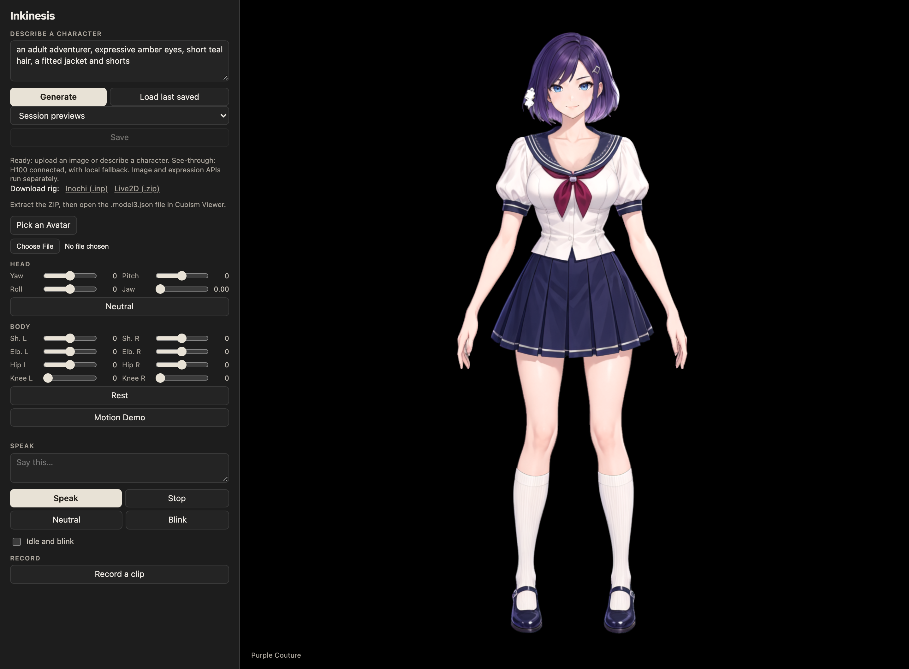

*Inspect the rig, try its controls, and save only the results you want to keep. To generate new characters, complete the [installation](#installation).*

## Live in VTube Studio

Take the character beyond the browser. Here, **Purple Couture's exported Live2D model runs in VTube Studio**, with live face tracking driving expressions and hand positions mapped to the rig's shoulder and elbow controls.

<table>
<tr><th>Face tracking</th><th>Face + hand-driven arm gestures</th></tr>
<tr>
<td width="41%">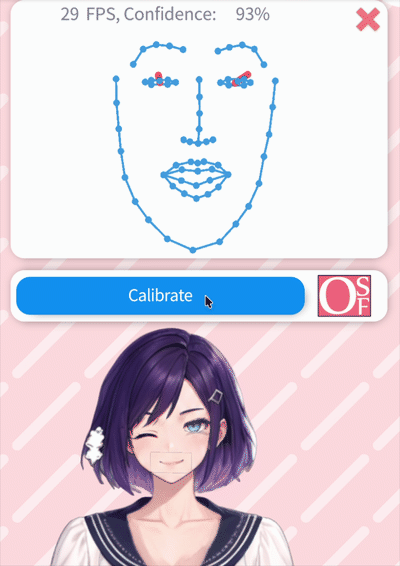</td>
<td width="59%">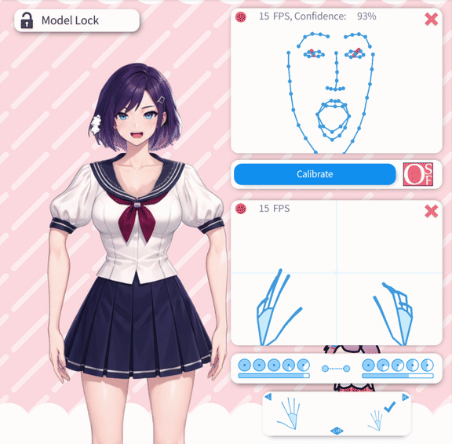</td>
</tr>
</table>

*Selected four-second excerpts from actual local sessions, at original speed. Cropped to the avatar and tracking panels; no desktop or raw camera image is shown.*

Use **Live2D (.zip)** in the viewer to download a model package. See the [export guide](docs/instructions/live2d_export.md) for its contents and requirements. The hand-to-arm mappings shown here are not part of the export and do not animate individual fingers. `tools/remote/configureVtubeArms.py` adds the same four bounded shoulder and elbow mappings to a model's `.vtube.json` profile while VTube Studio is closed, keeping a backup of the original profile.

## How it works

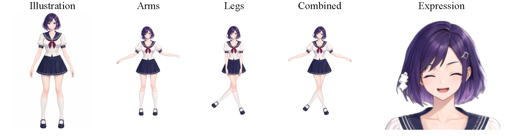

*From one illustration to a rig with arm, leg and expression controls. Every panel is a render of the generated asset.*

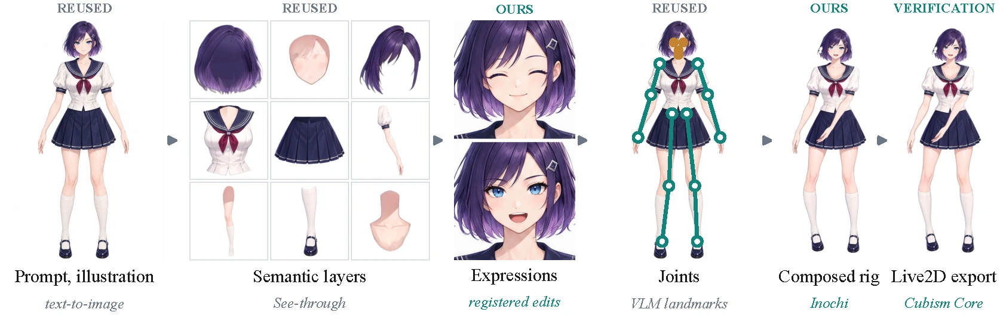

Inkinesis reuses strong existing components and adds the layer between them. **Reused:** text-to-image drawing, See-through semantic decomposition, VLM joint landmarks, and psd2live facial keyforms. **Ours:** measured expression edits registered to the unchanged face, anatomical garment ownership, a continuous two-joint limb rig, and a coherent head-pitch field. **Verification:** every export is evaluated by the native Inochi2D runtime and, for Live2D, by the official Cubism Core.

**Movement is assessed region by region:** an obscured hip need not prevent an independently usable arm from moving. The UI explains available controls in **Movement details**. Generated rigs still need visual review.

## What you get

Each run, saved from the UI or written by the CLI, is a self-contained folder:

```text
outputs/<run-id>/
├── character.inp        Inochi2D rig: meshes, textures, head, expression and limb parameters
├── layers.psd           semantic layers as decomposed
├── assets/character.psd prepared layers with registered expression patches
├── analysis.json        joint landmarks, confidence and per-region motion assessment
├── report.json          stages, validation results, file inventory and review status
├── demo.gif             animated preview
├── frames/              native-runtime evidence renders
└── live2d-<run-id>/model/
    ├── Character.moc3          Live2D runtime model
    ├── Character.model3.json   manifest referencing textures and parameters
    ├── Character.cdi3.json     parameter display names
    ├── Character.cmo3          reconstructed Cubism Editor project
    └── *.png                   texture atlases
```

Prepared example downloads contain the same `character.inp` and a `Live2D.zip` with the `model/` folder above.

## Installation

For **generating new rigs**, use macOS on Apple Silicon or Linux with NVIDIA CUDA. Choose local inference or the optional remote H100 bridge; an H100 is not required. For prepared rigs, use the [viewer quick start](#try-the-viewer).

### 1. Install system prerequisites

- Node.js **22+**, npm, and Git.
- Python **3.14** for preparation; Python **3.12** for local GPU inference.
- JDK **21** and a D compiler with DUB for the native verifier.
- Optional: eSpeak NG for speech and lip-sync previews.

Set `JAVA_HOME` to JDK 21, or configure `RIG_JAVA_HOME` in `.env`.

### 2. Install dependencies

Run from the repository root:

```sh
python3.14 -m venv .venv
.venv/bin/python -m pip install --upgrade pip
.venv/bin/python -m pip install -r requirements.txt
npm ci
```

### 3. Configure providers

```sh
cp .env.example .env
```

Fill in your keys and model IDs in `.env`:

```dotenv
ANTHROPIC_API_KEY=your-analysis-key
OPENAI_API_KEY=your-image-key
RIG_ANALYSIS_MODEL=your-available-anthropic-vision-model-id
IMAGE_MODEL=your-available-image-generation-and-edit-model-id
```

Both providers are used for generation from text or an image, including expression edits. Use model IDs enabled for your accounts. API calls incur provider charges; keep `.env` private.

### 4. Prepare the engine and choose your GPU

All generation backends need the local engine and verifier:

```sh
mkdir -p .cache/rig
git clone https://github.com/tsunehimatoi/psd2live.git .cache/rig/psd2live
git -C .cache/rig/psd2live checkout 5526f2e16b57e5f83d34f33730d6fa26d8bc8695
(cd .cache/rig/psd2live && bash ./gradlew --no-daemon classes)
npm run prepare:inochi
```

Expand **one** backend below and follow its steps. Local weights require about **12.5 GiB of disk space**; inference requires a compatible GPU with BF16 support. CPU-only See-through inference is not implemented.

<details>
<summary><strong>NVIDIA CUDA · local inference on Linux</strong></summary>

Use a driver compatible with the CUDA 12.8 wheels:

```sh
python3.12 -m venv .venv-gen
.venv-gen/bin/python -m pip install --upgrade pip
.venv-gen/bin/python -m pip install torch==2.8.0 torchvision==0.23.0 --index-url https://download.pytorch.org/whl/cu128
.venv-gen/bin/python -m pip install -r requirements-gpu.txt
git clone https://github.com/shitagaki-lab/see-through.git .cache/rig/see-through
git -C .cache/rig/see-through checkout 7f139bb25c46a0c8ac720d95ddab185fcda5451c
.venv-gen/bin/python tools/generate/downloadModels.py --output .cache/rig/models
```

Add to `.env`:

```dotenv
RIG_GPU_BACKEND=local
RIG_DEVICE=cuda
```

</details>

<details>
<summary><strong>Apple Silicon MPS · local inference on macOS</strong></summary>

```sh
python3.12 -m venv .venv-gen
.venv-gen/bin/python -m pip install --upgrade pip
.venv-gen/bin/python -m pip install torch==2.8.0 torchvision==0.23.0
.venv-gen/bin/python -m pip install -r requirements-gpu.txt
git clone https://github.com/shitagaki-lab/see-through.git .cache/rig/see-through
git -C .cache/rig/see-through checkout 7f139bb25c46a0c8ac720d95ddab185fcda5451c
.venv-gen/bin/python tools/generate/downloadModels.py --output .cache/rig/models
```

Add to `.env`:

```dotenv
RIG_GPU_BACKEND=local
RIG_DEVICE=mps
```

The MPS runner requires BF16 support. The dependency pins originate from the CUDA environment; this exact fresh combination has not been validated on every macOS version. See [device troubleshooting](docs/instructions/setup_troubleshooting.md#gpu-and-memory).

</details>

<details>
<summary><strong>Remote H100 · See-through over JupyterHub</strong></summary>

Follow [remote setup](docs/instructions/remote_gpu.md) to install See-through and its weights on your H100 server, configure the local path mapping, and start the bridge. Set `RIG_GPU_BACKEND=h100` in your local `.env`.

H100-only operation skips the local `.venv-gen` environment and local See-through weights. Local preparation, Java, and the verifier above remain required. For `h100-first` fallback, also configure one of the local backends.

</details>

Third-party components and weights retain their own terms. Read [NOTICE](NOTICE), including the unresolved See-through depth-weight license, before redistribution.

### 5. Check setup and open the UI

```sh
npm run check:setup
npm run dev
```

Open **http://localhost:5200/**, describe a character and press **Generate**, or upload an image. Restart the dev server after changing `.env`. If setup or a run fails, follow [setup troubleshooting](docs/instructions/setup_troubleshooting.md).

## Generating from the command line

```sh
npm run inkinesis -- --prompt "An adult adventurer with teal hair and a fitted jacket"
npm run image-to-rig -- --image /path/to/character.png --out outputs/my-character
npm run image-to-rig -- --image /path/to/character.png --out outputs/my-character --resume
npm run image-to-rig -- --image /path/to/character.png --live2d
npm run export:live2d -- outputs/my-character/character.inp outputs/my-live2d Character
```

CLI runs write directly to an output directory. UI runs stay temporary until you press **Save**; see [saving and downloads](docs/instructions/image_to_rig.md#saving-and-downloads) for where files go and how the Live2D package is prepared.

## Limits

- **One front-facing character** per image, full body, on a plain background. Multiple characters and unsuitable face views are refused.
- **Separated limbs and visible joints** give the best rigs. A hidden joint restricts only its own chain: an arm under a coat stays fixed while the other arm and the head keep moving.
- **Clothing, facial hair and accessories are preserved**, not simplified to make rigging easier.
- **The mouth is a measured patch**, not separately articulated teeth and tongue; seams can show at extreme poses or on unusual designs.
- **Every generated rig is marked for visual review.** Geometry checks catch reversed triangles and runtime mismatches, not texture quality or natural anatomy.

## Development

```sh
npm run typecheck
npm run lint
npm test
npm run test:python
npm run build
npx playwright install chromium
# In another terminal, start npm run dev; then:
npm run verify:ui
npm run verify:example-download
# Optional: after installing all 27 example avatars locally:
npm run verify:examples
node --import tsx tools/verify/uiSaveSmoke.ts
```

Portable tests use authored synthetic geometry. Optional native parity tests require separately supplied private assets via `RIG_TEST_ASSET_DIR`; they are explicitly skipped when those assets are absent. UI smoke tests make no model calls. `npm run build` produces `dist/player`; static hosting supports uploaded-rig preview, while example installation, generation, and export preparation require the local dev service. This service is for a trusted local machine, not an authenticated multi-user server.

## Documentation

- [Setup troubleshooting](docs/instructions/setup_troubleshooting.md)
- [Example avatar distribution](docs/instructions/avatar_library.md)
- [Pipeline stages, saving and downloads](docs/instructions/image_to_rig.md)
- [Preparation and motion](docs/instructions/independent_preparation.md)
- [Live2D export](docs/instructions/live2d_export.md)
- [Remote H100 setup](docs/instructions/remote_gpu.md)
- [Optional quality checks](docs/instructions/quality_control.md)
- [Release scope](docs/RELEASE.md)

## Acknowledgements

Inkinesis stands on work we are grateful for:

- **[See-through](https://github.com/shitagaki-lab/see-through)** for semantic layer and depth decomposition of character illustrations.
- **[psd2live](https://github.com/tsunehimatoi/psd2live)** for facial keyforms and the Live2D serialization path.
- **[Inochi2D](https://github.com/Inochi2D/inochi2d)** for the open puppet format and the native runtime used for verification.
- **[Live2D Cubism SDK](https://www.live2d.com/en/sdk/about/)** for the official Core used in export validation.
- **[eSpeak NG](https://github.com/espeak-ng/espeak-ng)** for phoneme timing behind the speech preview.

## Licensing

Core project code is Apache-2.0. The psd2live adapters have GPL-3.0-only headers and run in a separate process. External software, model weights, SDKs, and user artwork retain their own terms. See [NOTICE](NOTICE) and [asset licensing](LICENSE-ASSETS.md). To cite this project, use [CITATION.cff](CITATION.cff).
